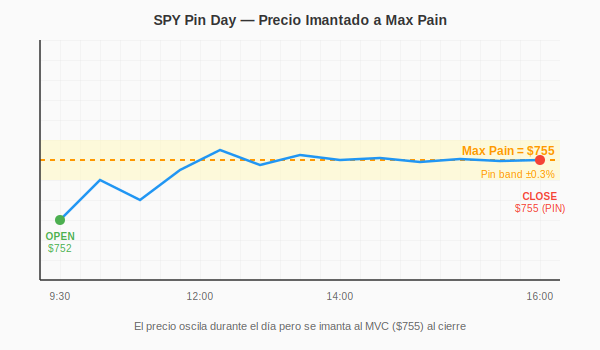
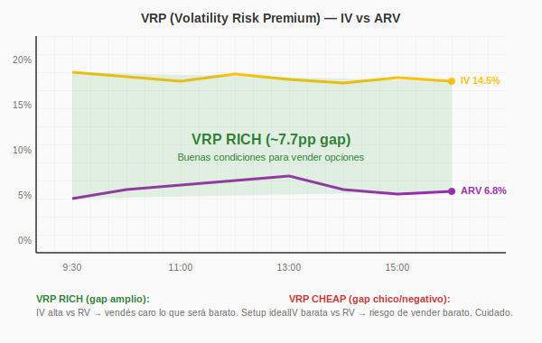
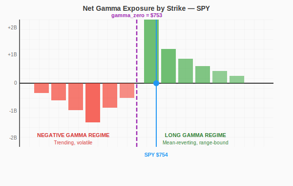
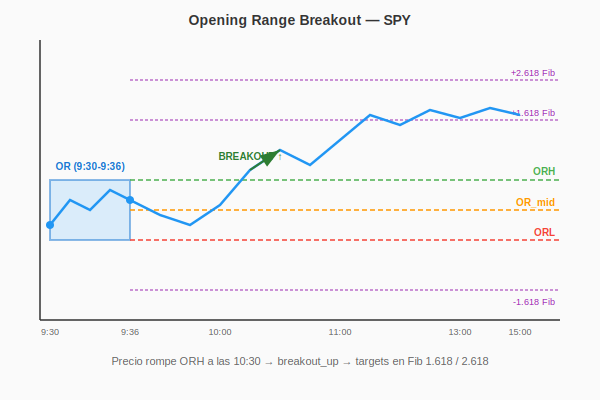

# Eolo Crop — Glosario Operativo

Conceptos técnicos centrales del sistema CROP con visualizaciones e interpretaciones operativas.

Audiencia: humanos (Juan + colaboradores) + LLM (system_prompt referencia).

---

## 1. Pin / Pinning / Max Pain

### Concepto

El precio del subyacente "se imanta" hacia ciertos strikes específicos al acercarse al vencimiento de las opciones. Es comportamiento natural de market makers cubriéndose dinámicamente: cuando el precio se acerca a un strike con mucho open interest, los MMs venden delta hedge si sube y compran si baja, creando una "trampa" cerca del strike.

**Max Pain** = el strike donde MÁS opciones expirarían sin valor (combinando puts + calls). Los MMs ganan más si el precio cierra ahí. Estructuralmente, hay incentivo del mercado a "llevar" el precio hacia el max pain al vencimiento.

### Visualización



El precio oscila durante el día y al cierre tiende a "imantarse" al strike con max OI. La banda gris representa el área de pinning (±0.3% del max pain).

### Operativa CROP

| Condición | Setup | Reglas |
|-----------|-------|--------|
| Spot en max_pain ±0.3% | Pin condition activa | TR-Juan-067 |
| Magnet score > 80 + spot AT pin | IRON_CONDOR ideal | TR-Juan-067 + TR-Juan-022 |
| Magnet score > 60 + spot lejano | Mean reversion bet (sell side opuesto) | TR-Juan-067 + TR-Juan-074 |
| Magnet score < 30 | No hay pin claro, ignorar | TR-Juan-067 |

### En QuantData

Buscar en el **Net GEX Heat Map** el strike resaltado (verde claro brillante) — ese es el MVC (Most Valuable Contract) = max_pain del día.

---

## 2. VRP (Volatility Risk Premium)

### Concepto

```
VRP = IV (implied volatility) - ARV (annualized realized volatility)
```

Es la "prima de seguro" que pagan los compradores de opciones por encima de la volatilidad real que va a ocurrir. Estructuralmente positivo porque la gente paga sobreprecio por protección (igual que un seguro de auto que cuesta más de lo que estadísticamente vas a chocar).

### Visualización



- **Línea amarilla** = IV (implied)
- **Línea morada** = ARV (realized)
- **Gap entre ambas** = VRP

Cuando el gap es amplio → VRP rich → bueno para vender opciones.
Cuando el gap es chico o invertido → VRP cheap → vender es arriesgado.

### Clasificación operativa

| VRP percentile (252d) | Score | Interpretación | Operativa |
|----------------------|-------|----------------|-----------|
| > 70 | rich | IV muy alta vs RV | SELL agresivo, premium rentable |
| 30-70 | fair | Neutral | NORMAL_OP |
| < 30 | cheap | IV barata vs RV | NO_NEW_SELLING (revisar TR-Juan-063) |
| N/A | none | Missing data | NO penalizar, usar otros indicadores |

### En QuantData

Volatility Drift chart muestra IV y ARV en vivo. Calcular VRP percentile contra histórico 252d (campo `vrp_percentile_252d` en snapshot).

---

## 3. GEX (Gamma Exposure)

### Concepto

Net Gamma Exposure dollarizado por strike. Mide cuánto delta deben hedgear los market makers por cada 1% de movimiento del subyacente.

**GEX positive** (verde): MMs son net LONG gamma → suprimen volatilidad (compran cuando baja, venden cuando sube). Mean-reverting.

**GEX negative** (rojo): MMs son net SHORT gamma → amplifican volatilidad (venden cuando baja, compran cuando sube). Trend-following.

### Visualización



### Gamma regime classification

| Regime | Condición | Comportamiento del mercado |
|--------|-----------|----------------------------|
| **long** | spot > gamma_zero + 0.5% | Mean-reverting, range-bound |
| **negative** | spot < gamma_zero - 0.5% | Trending, volátil |
| **transition** (flip_zone) | abs(spot - gamma_zero) < 0.5% | Régimen ambiguo, alta vol esperada |

`gamma_zero_strike` = punto donde Net GEX cruza por cero. Por encima = long gamma regime, por debajo = negative gamma regime.

### Operativa CROP

| Regime | Strategy preferida | Reglas |
|--------|--------------------|--------|
| Long gamma + IVR>50 | SELL_PUT Δ 0.20 | TR-Juan-072 + TR-Juan-082 |
| Long gamma + IVR<50 | SELL_PUT Δ 0.15, DTE 1-4 | TR-Juan-082 |
| Negative gamma + IVR>70 | SELL_PUT_SPREAD defensive | TR-Juan-072 |
| Negative gamma + IVR<50 | WAIT (cascade risk) | TR-Juan-064 |
| Flip zone | Cap conf=7, IC simétrico Δ 0.10 | TR-Juan-070 (relaxed) |

### En QuantData

**Exposure by Strike chart** muestra Net Gamma por strike. Verde positivo, rojo negativo. El strike donde cambia el signo (flip) = gamma_zero.

---

## 4. Magnet Score

### Concepto

Score 0-100 que computamos en `quantdata_features.py:compute_magnet_strength()`. Mide qué tan fuerte es la atracción del precio hacia el max_pain.

### Componentes

```
score_base depende de spot ↔ max_pain distance:
  ≤ 0.3% → 70
  ≤ 0.6% → 50
  ≤ 1.0% → 30
  > 1.0% → 10

+ bonus +10 cada uno si están dentro de 0.5% del max_pain:
  - gamma_zero_strike
  - oi_max_call_strike
  - oi_max_put_strike

= score final (capped 0-100)
```

### Interpretación

| Score | Interpretación | Operativa |
|-------|----------------|-----------|
| 80-100 | Muy fuerte. Pin confluence alta | IC ideal, captura theta pin |
| 60-79 | Fuerte. Magnet activo pero spot puede divergir | Direccional según net_drift |
| 30-59 | Medio. Magnet sugiere dirección | Sub-óptimo, sizing reducido |
| 0-29 | Débil. No hay magnet claro | Ignorar el factor |

### En QuantData

No tiene visualización directa. Se computa combinando: MVC del Heat Map + gamma_zero del Exposure by Strike + OI walls de la Option Chain.

---

## 5. Cascade Risk

### Concepto

Score 0-100 de "Cascade Defense Risk" (TR-Juan-064). Mide probabilidad de un movimiento explosivo bajista por confluencia de:
1. Spot < oi_max_put + 1 ATR (cascade_zone)
2. Negative GEX magnitude > 1B$
3. IVR call < 30 (sin cushion premium)
4. Put skew 25Δ > 5% (steep)
5. VIX > 22

### Niveles

| Score | Nivel | Operativa |
|-------|-------|-----------|
| 70-100 | extreme | WAIT real, cerrar puts existentes |
| 50-69 | high | NO abrir nuevas puts, defensive |
| 25-49 | medium | Reducir sizing puts ×0.5 |
| 0-24 | low | Operativa normal |

---

## 6. Smart Money Bias

### Concepto

Bias direccional según drift de premium institucional (TR-Juan-066, TR-Juan-068):
- `net_call_premium_drift` vs `net_put_premium_drift` → diff
- Skew 25Δ put vs call

### Clasificación

| Bias | Threshold | Acción |
|------|-----------|--------|
| bullish | diff > +$5M | SELL_PUT favorecido (smart money compra calls) |
| bearish | diff < -$5M | SELL_CALL favorecido |
| neutral | |diff| < $5M | Sin sesgo, usar otros factores |

Conviction 0-100 escala con magnitud del diff.

---

## 7. Opening Range (OR)

### Concepto (TR-Juan-077)

Rango definido por high/low de los primeros 6 minutos de sesión (9:30-9:36 ET).

```
ORH = high del rango
ORL = low del rango
OR_mid = (ORH + ORL) / 2
OR_width = ORH - ORL
```

### Visualización



Fibonacci extensions arriba/abajo del rango: 1.618, 2.236, 2.618 — usados como targets de breakout.

### Operativa

| Estado precio | Estado OR | Setup |
|---------------|-----------|-------|
| ORL ≤ spot ≤ ORH | in_range | Range trading, IC simétrico |
| spot > ORH + 0 a 1.618 fib | breakout_up | SELL_PUT direccional |
| spot > ORH + 1.618 a 2.618 fib | deep_above | Continuation play |
| spot < ORL similar | breakout_down / deep_below | SELL_CALL direccional |

---

## 8. IV Rank (IVR)

### Concepto

Percentil de IV30 actual contra histórico 252 días.

```
IVR = (IV_today - IV_min_252d) / (IV_max_252d - IV_min_252d) × 100
```

### Interpretación

| IVR | Interpretación | Operativa |
|-----|----------------|-----------|
| > 70 | IV alta vs histórica | SELL_PUT premium rico |
| 30-70 | IV normal | Operativa baseline |
| < 30 | IV baja vs histórica | Premium pobre, SELL_PUT sub-óptimo |

Calculado per ticker (no global VIX).

---

## 9. ARV (Annualized Realized Volatility)

### Concepto

Volatilidad realmente ocurrida en los últimos N días, anualizada.

```
RV_20d = stdev(daily_returns_20d) × sqrt(252)
```

Comparada con IV: si IV >> ARV → VRP rich. Si ARV creciendo mientras IV plano → momentum bajista incipiente (regla operativa de Juan).

---

## 10. Other key terms

### Cushion
Distancia entre el strike vendido y el spot, como porcentaje o $ absoluto. TR-Juan-001 define cushion mínimo per DTE y per ticker.

### Theta
Rate de decay del premium con el paso del tiempo. Más extremo cerca de expiración (0DTE = theta máximo).

### Delta (Δ)
Sensibilidad del premium al movimiento del subyacente. SELL_PUT Δ 0.20 = strike ~1 standard deviation OTM.

### DTE (Days To Expiration)
Días hasta expiración. CROP opera estricto 0-4 DTE (TR-Juan-072 AXIOMA).

### MVC (Most Valuable Contract)
Sinónimo de max_pain. Strike donde más opciones expiran sin valor.

---

## Referencias cruzadas

- KB v1.6: docs/KB_v1.6_REVIEW.xlsx
- Master Plan v2.2: docs/EOLO_CROP_MASTER_PLAN_v2.2_2026-06-04.docx
- Decision matrix: prompt_builder.py L43-150
- Compute layer: llm_engine/quantdata_features.py
- TOS Opening Range code: docs/strategy_references/OPENING_RANGE_TOS.md
- Daily Process: docs/strategy_references/DAILY_PROCESS_v1.md
